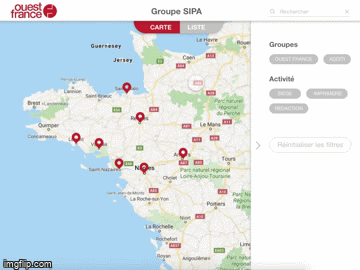

# Micro-appli-Ouest-France

## Demo

Cette micro-application a été un des projets réalisés pendant la formation Développeur d'applications hybrides. Elle est  actuellement utilisée lors de jours d’intégration et elle permet de géolocaliser toutes les agences du groupe SIPA Ouest-France et avoir des informations supplémentaires sous formes de cartes.

## Built With

* React Native 
* Google maps API
* Material UI

